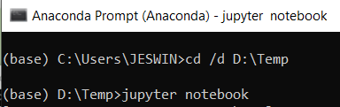
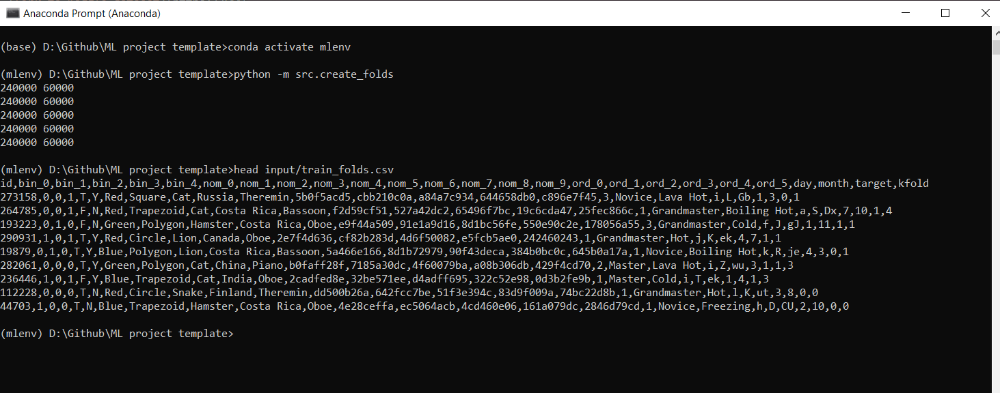

## Basics

Anaconda prompt change from the directory to the one you want to work on:



To check the number of environments created and to create a new environment.


Also install joblib

```
conda install joblib
```

In the environment execute the following command to install jupyter otherwise you will not be able to run jupyter notebook using this environment.

```
(mlenv) C:\Users\JESWIN>pip install jupyter
```


## [Episode 1.1 Intro and building a machine learning framework](https://youtu.be/ArygUBY0QXw?list=PL98nY_tJQXZnKfgWIADbBG182nFUNIsxw)

[Link to Kaggle dataset](https://www.kaggle.com/c/cat-in-the-dat)

Even though in the video Abhishek has used VScode editor, I will be using Anaconda and Spyder as thats what I use for my work.

After creating the __create_folds.py__ and executing the scripts via the anaconda prompt we get:




Now to start training the model we create the __train.py__ file.

We have created environment variables using the shell script.


Make sure that there is no unnecessary spacing between in the command lines as the shell script will throw errors.

```
export TRAINING_DATA=input/train_folds.csv
export FOLD=0

python -m src.train
```


Here we will be creating a framework for the different type of models we want to train.

The __dispatcher.py__ script will create a model.

[Extra tree classifier](https://scikit-learn.org/stable/modules/generated/sklearn.ensemble.ExtraTreesClassifier.html)

After adding models in __dispatcher.py__ we will update the __run.sh__.
ANd then correspondingly update the __train.py__.

So the __train.py__ will get model from dispatcher. And we can easily choose which model we want.

Now we can train the using randomforest using the shell command:

```
sh run.sh randomforest
```
Then we will get the rsult 0.74 as we got before.

Now we need to save stuff like label encoders and models using __joblib library__.

```
joblib.dump(value = label_encoders, filename = f"models/{MODEL}_label_encoder.pkl")
joblib.dump(value = clf, filename = f"models/{MODEL}.pkl")
```

The pkl files created above will be available in the folder models.


This is how your final folder must look like.


