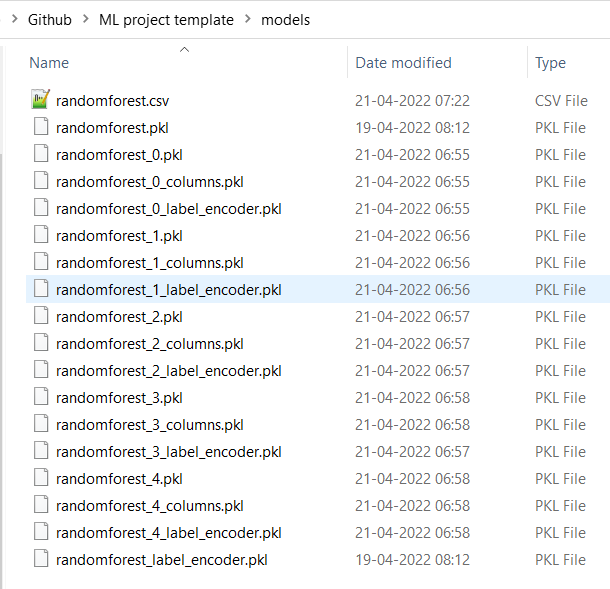

## [Episode 1.2: Building an inference for the machine learning framework](https://www.youtube.com/watch?v=zcqgj-Udcqs&list=PL98nY_tJQXZnKfgWIADbBG182nFUNIsxw&index=2)

### Finding inference

Now you need to train all the folds and make predictions on the test dataset.

So the main idea behind this method is that we have all models and folds saved in the __models__ folder. So we can do stacking and all types of blendings.

Also, training file and prediction files are quite compact. You need not built your model in the training file, you can define it in the dispatcher and use it

